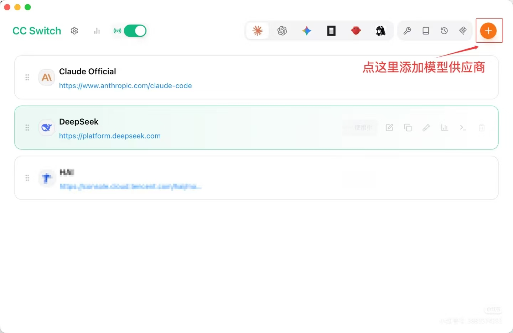
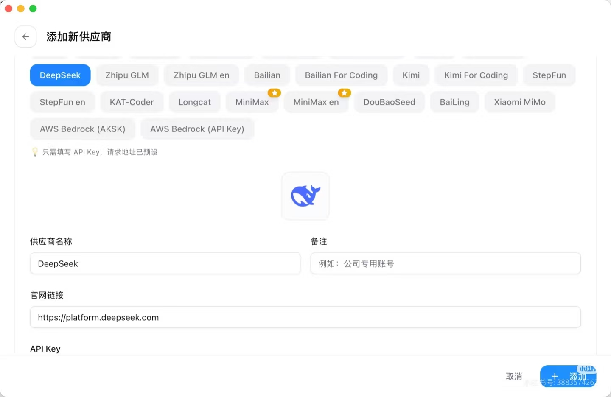
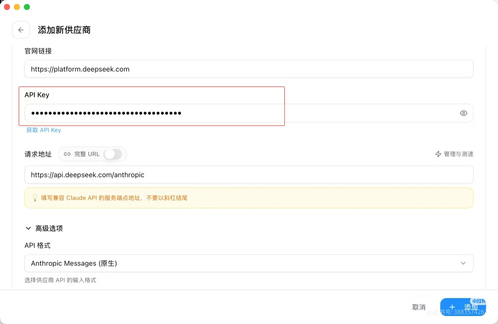
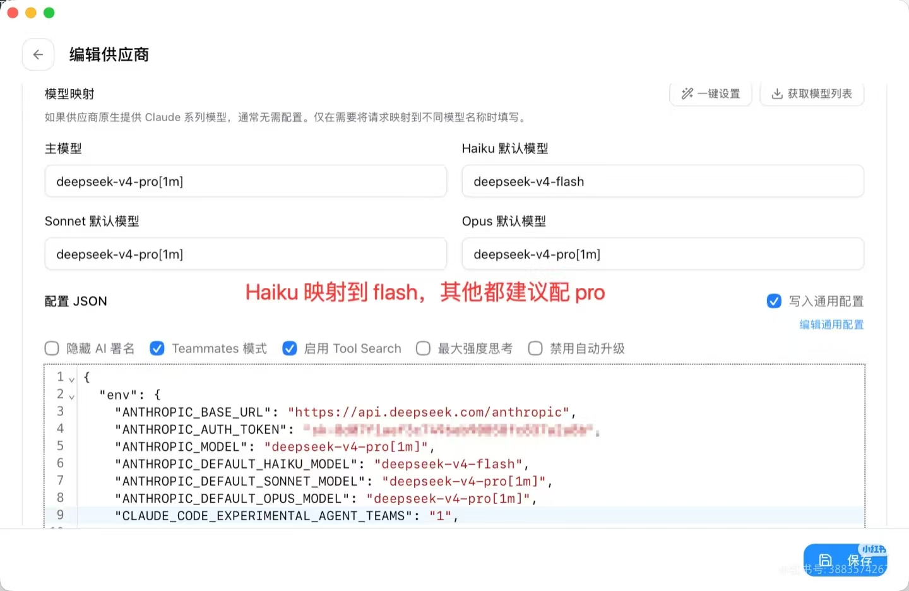
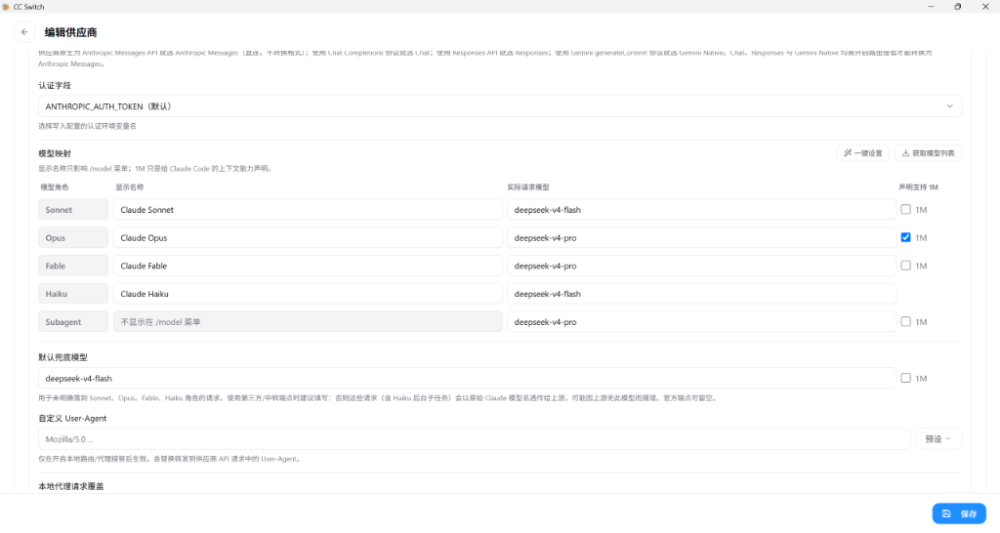
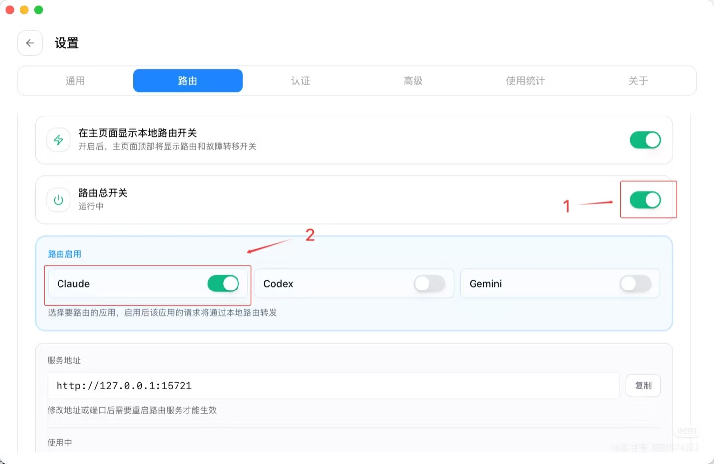

# 新电脑完整配置教程：Claude Code + cc-switch + DeepSeek（简化版）

> 适用环境：Windows 10/11，无需 VPN
> 最后更新：2026年9月2日

> **参考文献**：前几天发现 Claude Desktop 更新之后会强校验模型名称…… 【小红书】上有超棒的笔记，快来瞧瞧！<https://xhslink.cn/o/10wPoVptyVv>

---

## 前置条件

| 项目 | 说明 |
|------|------|
| 操作系统 | Windows 10/11 |
| Node.js | 版本 >= 16（[下载地址](https://nodejs.org/)） |
| DeepSeek API Key | 从 [platform.deepseek.com](https://platform.deepseek.com/) 获取 |
| 网络 | 无需 VPN，直连即可 |

---

## 第一步：安装 Node.js

1. 访问 <https://nodejs.org/>，下载 **LTS 版本**
2. 双击安装，一路点 `Next`
3. 安装完成后，打开 **CMD**，验证：

```cmd
node --version
npm --version
```

---

## 第二步：安装 Claude Code

```cmd
npm install -g @anthropic-ai/claude-code
```

验证：

```cmd
claude --version
```

---

## 第三步：安装 cc-switch 桌面版

### 3.1 下载

**唯一官网：** [https://ccswitch.io](https://ccswitch.io)

| 操作系统 | 下载文件 |
|----------|----------|
| Windows | `CC-Switch-v{version}-Windows.msi` |
| macOS | `CC-Switch-v{version}-macOS.dmg` |
| Linux | `CC-Switch-v{version}-Linux.AppImage` 或 `.deb` |

### 3.2 安装

- **Windows**：双击 `.msi`，按提示安装
- **macOS**：双击 `.dmg`，拖入「应用程序」文件夹
- **Linux**：`.deb` 用 `sudo dpkg -i` 安装；`.AppImage` 赋予执行权限后直接运行

---

## 第四步：配置 cc-switch（一体化完成）

### 4.1 启动 cc-switch

安装后打开 cc-switch 桌面应用

### 4.2 添加 DeepSeek 供应商

点击右上角的 `+` 按钮添加新模型供应商：



在弹出的「添加新供应商」页面中选择 **DeepSeek**（或其它供应商标签），填写供应商名称、官网链接等信息：



填写 API Key，确认请求地址为 `https://api.deepseek.com/anthropic`：



| 字段 | 填写内容 |
|------|----------|
| **供应商名称** | `DeepSeek` |
| **备注** | `我的 DeepSeek`（可选） |
| **APIKey** | `sk-你的DeepSeek密钥` |
| **请求地址** | **`https://api.deepseek.com/anthropic`**（关键！必须用这个地址） |

### 4.3 配置模型映射（关键！）

在「编辑供应商」页面的「高级选项」→「模型映射」中填写：



完整模型映射配置图（含 Sonnet / Opus / Fable / Haiku / Subagent 等所有角色）：



| 模型角色 | 显示名称 | 实际请求模型 | 声明支持 1M |
|---------|---------|-------------|------------|
| Sonnet | `Claude Sonnet` | `deepseek-v4-flash` | 不勾选 |
| Opus | `Claude Opus` | `deepseek-v4-pro` | 勾选 |
| Fable | `Claude Fable` | `deepseek-v4-pro` | 不勾选 |
| Haiku | `Claude Haiku` | `deepseek-v4-flash` | 不勾选 |
| Subagent | `不显示在 /model 菜单` | `deepseek-v4-pro` | 不勾选 |
| **默认兜底模型** | - | **`deepseek-v4-flash`** | 不勾选 |

下方「配置 JSON」区域建议勾选：**Teammates 模式**、**启用 Tool Search**，Haiku 映射到 flash，其他都建议配 pro。

### 4.4 开启路由 + 同步配置（二合一）

1. **开启路由**：在「设置 → 路由」页面打开 **「路由总开关」**，并勾选 **「Claude」**，确认状态变为 **「运行中」**：



2. **同步配置（关键一步）**：在 cc-switch 中点击 **「写入配置」** 或 **「应用」** 按钮，cc-switch 会自动把以下内容写入 `C:\Users\%USERNAME%\.claude\settings.json`：

```json
{
  "env": {
    "ANTHROPIC_AUTH_TOKEN": "sk-你的DeepSeek密钥",
    "ANTHROPIC_BASE_URL": "http://127.0.0.1:15721",
    "CLAUDE_CODE_DISABLE_UNKNOWN_MODEL_WINDOW_ENFORCEMENT": "1"
  }
}
```

> **注意**：这一步是**自动完成**的，你**不需要**手动创建或编辑 `settings.json` 文件。

3. 记下**服务地址**：`http://127.0.0.1:15721`（已自动写入配置）

---

## 第五步：验证配置

### 5.1 确认 cc-switch 路由正在运行

- 打开 cc-switch GUI
- 确认「路由总开关」是 **「运行中」**
- 确认「Claude」已勾选

### 5.2 启动 Claude Code

在 CMD 中执行：

```cmd
claude
```

### 5.3 选择模型

进入后输入：

```
/model
```

选择 **`claude-opus`** 或 **`Default (recommended)`**，按 Enter。

### 5.4 测试对话

输入：

```
你好
```

如果 DeepSeek 正常回复，说明配置成功！

---

## 第六步：常用命令速查

| 命令 | 作用 |
|------|------|
| `claude` | 启动 Claude Code |
| `/model` | 切换模型 |
| `/status` | 查看当前配置 |
| `/theme` | 更改主题 |
| `/help` | 查看所有命令 |
| `/exit` | 退出 |

---

## 常见问题排查

| 问题 | 原因 | 解决方法 |
|------|------|----------|
| 启动后报 `403` | API Key 无效或余额不足 | 检查 DeepSeek 账户余额和 API Key |
| 启动后报 `ECONNRESET` | 路由服务未启动 | 检查 cc-switch 路由是否运行 |
| 模型报错 `not found` | 模型映射配置错误 | 检查 cc-switch 中的实际请求模型名 |
| `/model` 菜单无选项 | Claude Code 未连接到路由 | 确认已点击「写入配置」，检查 `settings.json` 中的 `BASE_URL` |
| 启动后仍连接官方 API | `settings.json` 未被写入 | 在 cc-switch 中重新点击「写入配置」 |
| cc-switch 无法启动 | 端口被占用 | 在 cc-switch 中修改服务端口，同步修改 `settings.json` |

---

## 总结

| 关键配置项 | 正确值 |
|-----------|--------|
| **DeepSeek API 地址** | **`https://api.deepseek.com/anthropic`**（必须用这个） |
| cc-switch 服务地址 | `http://127.0.0.1:15721` |
| settings.json 写入方式 | **cc-switch 自动写入**，无需手动编辑 |
| 模型映射 | `claude-opus` → `deepseek-v4-pro` |
| Claude Code 模型 | `/model` 中选择 `claude-opus` |

---

## 核心要点

1. **DeepSeek 地址必须用 `https://api.deepseek.com/anthropic`**，不能用 `/v1`
2. **cc-switch 路由必须开启**，Claude Code 才能通过本地网关转发请求
3. **模型映射必须配对**，Claude 模型名 → DeepSeek 实际模型名
4. **配置由 cc-switch 自动写入**，不需要手动创建 `settings.json`

---

## 附录：完整 settings.json 参考配置（使用本地代理 cc-switch）

如果使用本地代理（cc-switch 路由地址 `http://127.0.0.1:15721`，子代理模型指定为 `deepseek-v4-pro`），可参考以下完整 JSON 写入 `C:\Users\%USERNAME%\.claude\settings.json`：

```json
{
  "env": {
    "ANTHROPIC_AUTH_TOKEN": "PROXY_MANAGED",
    "ANTHROPIC_BASE_URL": "http://127.0.0.1:15721",
    "ANTHROPIC_DEFAULT_FABLE_MODEL": "claude-fable-5",
    "ANTHROPIC_DEFAULT_FABLE_MODEL_NAME": "Claude Fable",
    "ANTHROPIC_DEFAULT_HAIKU_MODEL": "claude-haiku-4-5",
    "ANTHROPIC_DEFAULT_HAIKU_MODEL_NAME": "Claude Haiku",
    "ANTHROPIC_DEFAULT_OPUS_MODEL": "claude-opus-4-8[1M]",
    "ANTHROPIC_DEFAULT_OPUS_MODEL_NAME": "Claude Opus",
    "ANTHROPIC_DEFAULT_SONNET_MODEL": "claude-sonnet-4-6",
    "ANTHROPIC_DEFAULT_SONNET_MODEL_NAME": "Claude Sonnet",
    "CLAUDE_CODE_EXPERIMENTAL_AGENT_TEAMS": "1",
    "CLAUDE_CODE_SUBAGENT_MODEL": "deepseek-v4-pro",
    "ENABLE_TOOL_SEARCH": "true"
  },
  "model": "claude-opus"
}
```

---


