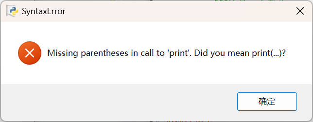
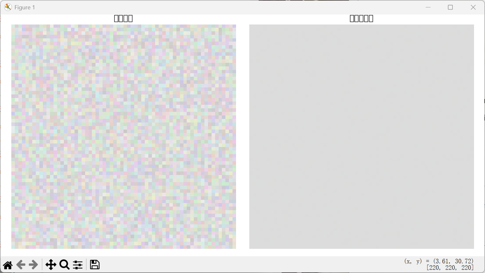

###Python 学习记录

##错误1 



#问题1的原因：
    这个错误是因为在 Python 3 中使用了 Python 2 的 print 语法。

#问题1的解决方法：
    1. 检查代码中是否有使用 print 语句。
    ```
    print "Hello, World!"
    ```
    2. 如果有，将其替换为 Python 3 的 print 函数。
    ```
    print("Hello, World!")
    ```
    3. 保存文件并重新运行。


##错误2



#问题2的原因：
    这个错误是因为缺少了能让图片上显示中文的配置。

#问题2的解决方法：

使用 Matplotlib + 中文字体配置

-方法一：设置全局字体

```
import matplotlib.pyplot as plt

# 设置中文字体为黑体（Windows）
plt.rcParams['font.sans-serif'] = ['SimHei']
plt.rcParams['axes.unicode_minus'] = False  # 正常显示负号

# 示例
plt.title("中文标题")
plt.xlabel("横轴")
plt.ylabel("纵轴")
plt.plot([1, 2, 3], [4, 5, 6])
plt.show()

```
-使用自定义字体文件

```
import matplotlib.pyplot as plt
from matplotlib.font_manager import FontProperties

# 指定字体文件路径（例如思源黑体）
font = FontProperties(fname="SourceHanSansSC-Regular.otf")

plt.title("中文标题", fontproperties=font)
plt.xlabel("横轴", fontproperties=font)
plt.ylabel("纵轴", fontproperties=font)
plt.plot([1, 2, 3], [4, 5, 6])
plt.show()
```
