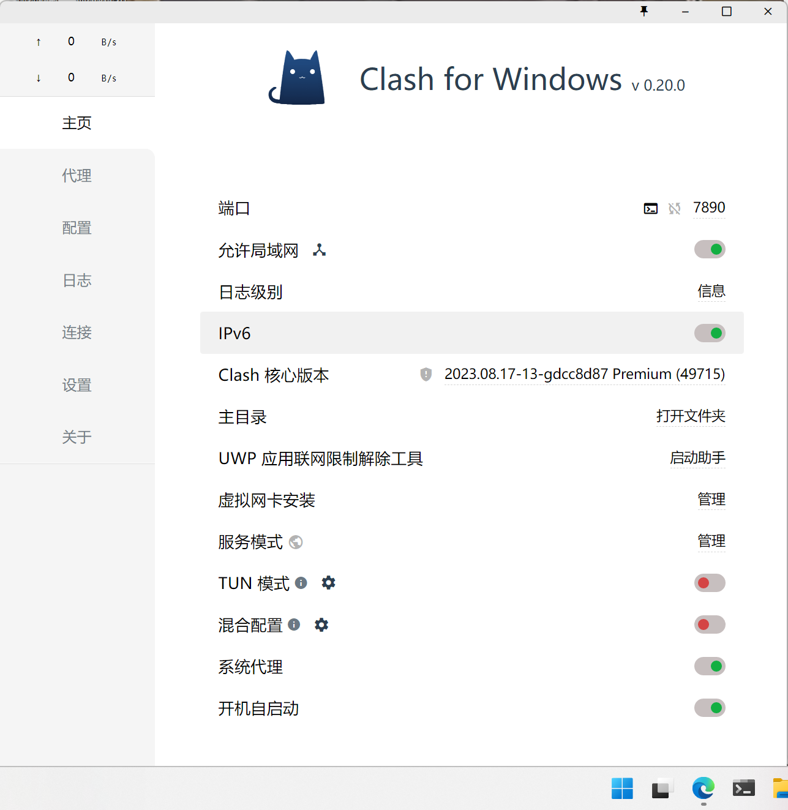

# Python 学习与实践指南

## 资料
**代码**  
**书**  
《Python数学实践与建模》  
[下载链接](https://pan.quark.cn/s/acccba4fcb48)  
提取码：VXPF  
**时间紧张看1-4章**

## 下载软件
**Python**  
（不要下最新版本的，我下的版本为3.10.0）  
[Python 3.10.0 下载](https://www.python.org/downloads/release/python-3100/)  
**教程在书的第一章，配置过程一样**

**pip**  
[pip 官方页面](https://pypi.org/project/pip/#files)  
**下载地址**：[pip-25.1.1-py3-none-any.whl](https://pypi.org/project/pip/#files) （1.8 MB 查看详情)

## 论文
**文献综述**  
[Web of Science](https://webofscience.clarivate.cn/wos/woscc/basic-search)

**画图**  
（主要是Python）  
**Graphing Calculator 3D**

**论文**  
（可查重）  
[Sci-Hub](https://www.scihub.net.cn/)
## 问题与方法
### 不兼容
你在尝试安装时遇到了编译错误，核心问题出在模块与当前环境（Python 3.13 + 最新 NumPy）不兼容  
#### 不兼容的解决方法  
降级 Python 版本，目前还不支持 Python 3.13，推荐使用 Python 3.10 或 3.9  
卸载当前版本，重新安装（记得删除之前的配套文件）

### 网络配置问题
ValueError: check_hostname requires server_hostname  
这通常意味着 pip 在通过代理服务器访问 PyPI 时，没有正确设置服务器名称验证参数，是一个网络/SSL 层面的错误。  
#### 原因  
处于代理网络（如公司或学校）下，但 pip 没正确设置代理。  
先尝试查看环境变量 http_proxy 和 https_proxy  
结果为空  
说明当前没有设置代理，或者设置无效。

### 网络配置解决
配置正确的系统代理  
可以通过如下命令临时指定代理服务器（请替换为你实际的代理地址）：  
`pip install cvxpy --proxy="http://用户名:密码@代理IP:端口"`  
如果不需要代理但 pip 默认使用了代理，可以检查环境变量：  
`echo $env:HTTP_PROXY`  
`echo $env:HTTPS_PROXY`  
如果发现它们被设置了，请清除：  
`Remove-Item Env:\HTTP_PROXY`  
`Remove-Item Env:\HTTPS_PROXY`

### pip 配置文件
在 PowerShell 输入以下命令，打开或新建 pip 配置文件：  
如果 pip 目录不存在，先创建：  
`mkdir $env:APPDATA\pip`  
`notepad $env:APPDATA\pip\pip.ini`  
在打开的 pip.ini 文件中，填入你需要的代理配置，比如（假设你有HTTP代理）：  
`[global]`  
`proxy = http://127.0.0.1:1080 `  

### 配置 pip 使用代理
修改 pip.ini 文件（路径：%APPDATA%\pip\pip.ini）为：  
`[global]`  
`proxy = http://127.0.0.1:7890 `  
`trusted-host = pypi.org`  
`files.pythonhosted.org`  
或通过命令行临时指定代理：  
`python -m pip install --proxy=http://127.0.0.1:7890  numpy`  
这时候应该就ok了
